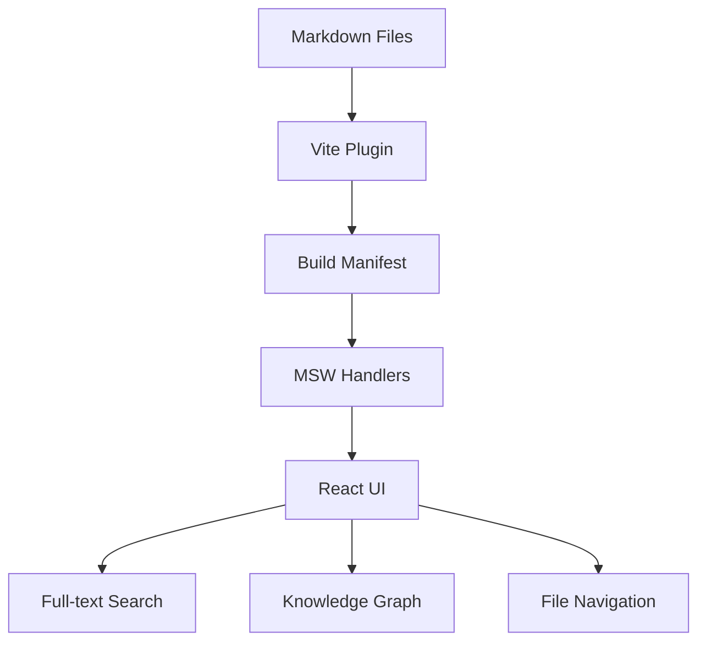

Welcome to **Zetty Doc Hub** — a powerful documentation platform that automatically discovers, organizes, and enhances your markdown content.

## Features

- **Full-text search** with fuzzy matching and relevance scoring
- ️**Interactive knowledge graphs** showing document relationships
- **Tags navigation** for browsing content by category
- **Backlinks & related content** to discover connections
- **Mermaid diagrams** for flowcharts and visualizations
- **Document statistics** with word count and reading time

## Quick Start

1. Add your `.md` files to the `/docs` folder
2. They appear automatically in the navigation
3. Use the search (Ctrl+K) to find content

## Architecture

This application uses a **Mock Service Worker (MSW)** architecture:

- All content is served via a REST API (`/api/docs/*`)
- In development/static builds, MSW intercepts these calls
- The manifest is baked in at build time by a Vite plugin
- To migrate to a real backend, simply swap MSW for Lambda/S3

See the [Getting Started Guide](getting-started/install.md) for setup instructions.

## Example Diagram

## Links

- [Installation Guide](getting-started/install.md)
- [Configuration](getting-started/configuration.md)
- [Feature Examples](examples/features.md)
