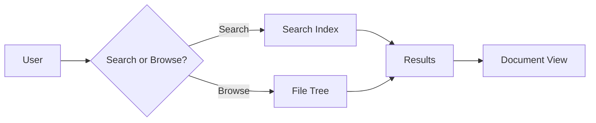
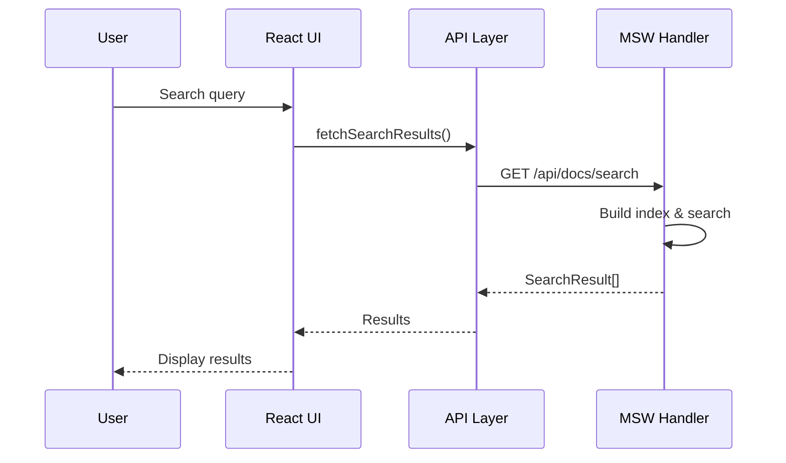

This page demonstrates the various features of Zetty Doc Hub.

## Markdown Features

### Text Formatting

You can use **bold**, *italic*, ~~strikethrough~~, and `inline code`.

### Lists

- Unordered list item 1
- Unordered list item 2
  - Nested item
  - Another nested item

1. Ordered list item
2. Second item
3. Third item

### Blockquotes

> "The best documentation is the documentation that gets read."
> — Documentation Best Practices

### Tables

| Feature | Status | Priority |
|---------|--------|----------|
| Search | ✅ Done | High |
| Graph | ✅ Done | Medium |
| Tags | ✅ Done | Medium |
| Backlinks | ✅ Done | Medium |

### Code Blocks

```typescript
interface DocumentProps {
  title: string;
  content: string;
  tags?: string[];
}

function renderDocument(props: DocumentProps) {
  console.log(`Rendering: ${props.title}`);
  return props.content;
}
```

```python
def hello_world():
    """A simple greeting function."""
    print("Hello from Zetty Doc Hub!")
    return True
```

## Mermaid Diagrams

### Flowchart



### Sequence Diagram



## Links & Navigation

- Back to [Home](../README.md)
- See [Installation](../getting-started/install.md)
- See [Configuration](../getting-started/configuration.md)
