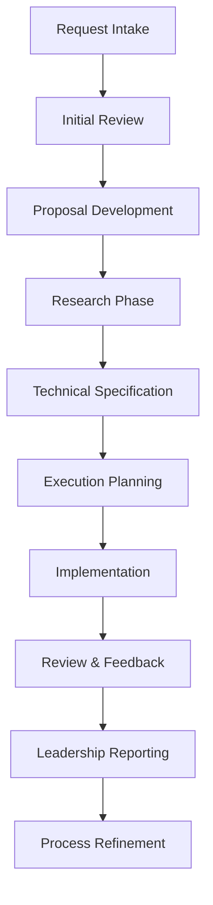

## Overview

This initiative focuses on streamlining technical documentation processes across the organization, establishing clear workflows from request intake through proposal development, research, technical specification, execution, and feedback review. Additionally, it defines how reporting and communication with leadership should be structured for maximum clarity and efficiency.

## Goals and Objectives

### Primary Goals
- **Streamlined Intake**: Create efficient processes for documentation requests and proposals
- **Clear Workflows**: Establish standardized paths from concept to execution
- **Leadership Visibility**: Implement clear reporting structures to leadership
- **Quality Assurance**: Ensure consistent documentation standards and review processes

### Success Metrics
- 📋 Reduce documentation request processing time by 60%
- 🚀 Decrease proposal-to-execution timeline by 40%
- 📊 Increase documentation quality scores to >4.5/5
- 💼 Improve leadership visibility with weekly progress reports

## Technical Approach

### Documentation Workflow Pipeline

### Process Architecture
- **Intake System**: Standardized request forms and triage process
- **Proposal Framework**: Templates for technical proposals and business cases
- **Research Methodology**: Structured approach to technical research and validation
- **Specification Standards**: Consistent technical documentation formats
- **Execution Tracking**: Progress monitoring and milestone management
- **Review Process**: Quality gates and feedback collection mechanisms

## Development Phases

### Phase 1: Foundation & Standards (Weeks 1-6)
- Establish documentation standards and templates
- Create intake and triage processes
- Set up tracking and reporting systems
- Define quality metrics and review criteria

### Phase 2: Workflow Implementation (Weeks 7-14)
- Deploy proposal development framework
- Implement research and specification processes
- Establish execution tracking mechanisms
- Create feedback and review workflows

### Phase 3: Leadership Integration (Weeks 15-20)
- Build leadership reporting dashboard
- Implement escalation and communication protocols
- Create executive summary templates
- Establish regular review cadences

### Phase 4: Optimization & Training (Weeks 21-26)
- Conduct team training on new processes
- Optimize workflows based on initial feedback
- Implement automation where possible
- Document lessons learned and best practices

## Key Features

### Request Intake & Triage
- **Standardized Forms**: Clear request templates with required information
- **Automated Routing**: Smart assignment based on request type and complexity
- **Priority Scoring**: Objective criteria for request prioritization
- **SLA Tracking**: Response time commitments and monitoring

### Proposal Development
- **Template Library**: Pre-built templates for common proposal types
- **Collaboration Tools**: Real-time editing and review capabilities
- **Stakeholder Review**: Structured approval workflows
- **Version Control**: Change tracking and document history

### Research & Specification
- **Research Framework**: Systematic approach to technical investigation
- **Specification Templates**: Consistent format for technical documents
- **Review Checkpoints**: Quality gates throughout the process  
- **Knowledge Base**: Centralized repository of research and decisions

### Leadership Reporting
- **Executive Dashboard**: High-level view of all active initiatives
- **Progress Reports**: Automated weekly status summaries
- **Escalation Alerts**: Proactive notification of risks and issues
- **Metrics Tracking**: Key performance indicators and trends

## Risk Assessment

### Process Risks
| Risk | Impact | Probability | Mitigation |
|------|--------|-------------|------------|
| Adoption resistance | High | Medium | Comprehensive training and change management |
| Tool integration complexity | Medium | High | Phased rollout with fallback options |
| Quality degradation | High | Low | Strong review processes and quality gates |

### Organizational Risks
| Risk | Impact | Probability | Mitigation |
|------|--------|-------------|------------|
| Resource constraints | Medium | Medium | Flexible timeline and scope management |
| Leadership buy-in | High | Low | Regular communication and value demonstration |
| Process overhead | Medium | Medium | Automation and efficiency optimization |

## Testing Strategy

### Process Validation
1. **Pilot Programs**: Small-scale testing with select teams
2. **Quality Audits**: Regular review of documentation output
3. **User Feedback**: Continuous collection of process feedback
4. **Performance Metrics**: Tracking of efficiency and quality indicators

### Success Criteria
- Pilot program success rate: > 85%
- Process adherence: > 90%
- Quality scores: > 4.5/5
- Time-to-completion improvement: > 40%

## Success Criteria

### Implementation Goals
✅ **Process Adoption**: 95% of teams using new workflows  
✅ **Quality Standards**: All documentation meets defined criteria  
✅ **Timeline Efficiency**: 40% reduction in end-to-end timelines  
✅ **Leadership Visibility**: Weekly reporting cadence established  
✅ **Team Satisfaction**: 4.0+ satisfaction scores from participating teams

### Post-Implementation Goals (6 months)
- 📈 **Efficiency**: 60% reduction in documentation overhead
- ⭐ **Quality**: 4.8+ average quality ratings
- 🔄 **Adoption**: 100% team participation in new processes
- 📊 **Leadership**: Monthly strategic reviews with data-driven insights

## Resource Requirements

### Team Composition
- **Process Lead** (1 FTE) - Overall program management and coordination
- **Technical Writer** (1 FTE) - Documentation standards and template development
- **Training Specialist** (0.5 FTE) - Change management and team training
- **Quality Analyst** (0.5 FTE) - Process monitoring and improvement
- **Technical Liaison** (0.25 FTE) - Engineering integration and support

### Budget Estimation
- Personnel: $200,000 - $250,000
- Tools and software: $25,000 annually
- Training and development: $15,000
- Process documentation: $10,000
- Contingency (10%): $25,000

## Timeline Milestones

| Milestone | Date | Deliverables |
|-----------|------|--------------|
| Process Design Complete | Mar 15, 2024 | Standards, templates, and workflow documentation |
| Pilot Program Launch | Apr 15, 2024 | Initial implementation with 3 teams |
| Full Rollout Begins | Jun 1, 2024 | Organization-wide process deployment |
| Leadership Integration | Jul 15, 2024 | Reporting systems and executive dashboards |
| Process Optimization | Aug 30, 2024 | Refined workflows and automation |

## Communication Plan

### Stakeholder Engagement
- **Weekly**: Team leads and process coordinators check-ins
- **Bi-weekly**: Progress updates to engineering leadership
- **Monthly**: Executive briefings with metrics and insights
- **Quarterly**: Strategic review and process optimization sessions

### Documentation & Training
- **Process Guides**: Step-by-step workflows and procedures
- **Training Materials**: Interactive workshops and self-paced learning
- **Best Practices**: Knowledge sharing and lessons learned
- **Change Log**: Version control and update notifications

## Leadership Reporting Structure

### Weekly Reports
- **Progress Summary**: Key activities and milestones achieved
- **Metrics Dashboard**: Efficiency, quality, and adoption metrics
- **Risk Assessment**: Current issues and mitigation strategies
- **Upcoming Priorities**: Next week's focus areas and dependencies

### Monthly Executive Reviews
- **Strategic Alignment**: Initiative progress against business objectives
- **ROI Analysis**: Cost-benefit analysis and value realization
- **Resource Utilization**: Team capacity and allocation optimization
- **Future Planning**: Upcoming quarters and strategic initiatives

## Conclusion

The Team Efficiency and Process Refactor initiative represents a strategic investment in organizational capability and operational excellence. By establishing clear, efficient processes for technical documentation and leadership communication, we can significantly improve team productivity while ensuring high-quality deliverables and transparent progress reporting.

This comprehensive approach addresses the full lifecycle of documentation work while providing leadership with the visibility and insights needed for strategic decision-making and resource allocation.