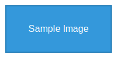

This document demonstrates the various Markdown features supported by Zetty Documentation Hub.

## Basic Text Formatting

### Text Styles

This is **bold text** and this is *italic text*. You can also use ***bold and italic*** together.

~~Strikethrough text~~ is also supported.

Here's some `inline code` and a [link to GitHub](https://github.com/awhipp/zetty-doc-hub).

### Blockquotes

> This is a blockquote. It can contain multiple lines and even other markdown elements.
>
> > Nested blockquotes are also possible.
>
> Back to the first level.

## Headers

# H1 Header

## H2 Header

### H3 Header

#### H4 Header

##### H5 Header

###### H6 Header

## Lists

### Unordered Lists

- First item
- Second item with **bold text**
- Third item with [a link](../getting-started/installation)
  - Nested item
  - Another nested item
    - Deeply nested item
- Fourth item

### Ordered Lists

1. First ordered item
2. Second ordered item
   1. Nested ordered item
   2. Another nested item
3. Third ordered item

### Task Lists

- [x] Completed task
- [x] Another completed task
- [ ] Incomplete task
- [ ] Another incomplete task
  - [x] Nested completed task
  - [ ] Nested incomplete task

## Code Examples

### Inline Code

Use `npm install` to install dependencies. The `buildFileTree()` function creates the navigation structure.

### Code Blocks

Basic code block:

```
This is a plain code block
No syntax highlighting applied
```

JavaScript with syntax highlighting:

```javascript
function greetUser(name) {
  return `Hello, ${name}! Welcome to Zetty Doc Hub.`;
}

const user = "Developer";
console.log(greetUser(user));
```

TypeScript example:

```typescript
interface FileTreeNode {
  name: string;
  path: string;
  type: 'file' | 'folder';
  children?: FileTreeNode[];
}

const buildFileTree = (): FileTreeNode[] => {
  const docsModules = import.meta.glob('/src/docs/**/*.{md,mdx}', { eager: false });
  // Implementation details...
  return [];
};
```

React component example:

```tsx
import React, { useState } from 'react';

const ExampleComponent: React.FC = () => {
  const [count, setCount] = useState(0);

  return (
    <div className="example-component">
      <h2>Counter: {count}</h2>
      <button onClick={() => setCount(count + 1)}>
        Increment
      </button>
    </div>
  );
};

export default ExampleComponent;
```

CSS example:

```css
.example-component {
  padding: 20px;
  border: 1px solid #ddd;
  border-radius: 8px;
  background-color: #f9f9f9;
}

.example-component h2 {
  color: #333;
  margin: 0 0 16px 0;
}

.example-component button {
  background-color: #007acc;
  color: white;
  border: none;
  padding: 8px 16px;
  border-radius: 4px;
  cursor: pointer;
}

.example-component button:hover {
  background-color: #005999;
}
```

Bash commands:

```bash
# Clone the repository
git clone https://github.com/awhipp/zetty-doc-hub.git

# Navigate to the project directory
cd zetty-doc-hub

# Install dependencies
npm install

# Start the development server
npm run dev

# Build for production
npm run build
```

JSON configuration example:

```json
{
  "name": "zetty-doc-hub",
  "version": "0.0.0",
  "scripts": {
    "dev": "vite",
    "build": "tsc -b && vite build",
    "lint": "eslint .",
    "preview": "vite preview"
  },
  "dependencies": {
    "react": "^19.1.0",
    "react-dom": "^19.1.0",
    "react-markdown": "^10.1.0"
  }
}
```

## Tables

### Basic Table

| Feature | Status | Description |
|---------|--------|-------------|
| File Tree Navigation | ✅ Complete | Browse docs with expandable tree |
| Markdown Rendering | ✅ Complete | Full GFM support with syntax highlighting |
| Syntax Highlighting | ✅ Complete | Code blocks with language support |
| URL Routing | ✅ Complete | Shareable links for all documents |
| Search | 🚧 Planned | Full-text search across documentation |
| Themes | 🚧 Planned | Light and dark theme support |

### Alignment Examples

| Left Aligned | Center Aligned | Right Aligned |
|:-------------|:--------------:|--------------:|
| Default | Center | Right |
| Text | Text | Text |
| More content | More content | More content |

### Complex Table

| Component | File | Purpose | Props | State |
|-----------|------|---------|-------|-------|
| `SidePanel` | `SidePanel.tsx` | Main navigation panel | `onFileSelect`, `selectedFile` | File tree data |
| `FileTreeNode` | `FileTreeNode.tsx` | Individual tree nodes | `node`, `level`, `onFileSelect` | Expansion state |
| `MainContent` | `MainContent.tsx` | Content display area | `filePath` | Loading, error states |
| `MarkdownRenderer` | `MarkdownRenderer.tsx` | Markdown processing | `content` | Rendered output |

## Links

### Internal Links

- [Getting Started Guide](../getting-started/installation)
- [Quick Start](../getting-started/quick-start)
- [Configuration Guide](../getting-started/configuration)

### External Links

- [React Documentation](https://react.dev/)
- [TypeScript Handbook](https://www.typescriptlang.org/docs/)
- [Vite Guide](https://vitejs.dev/guide/)
- [React Router](https://reactrouter.com/)
- [Markdown Guide](https://www.markdownguide.org/)

### Link with Title

[Zetty Doc Hub Repository](https://github.com/awhipp/zetty-doc-hub "Official Zetty Documentation Hub Repository")

## Images

### Absolute Image Reference

Here's a local image stored in the references folder:


### Relative Image Reference

This should also work with a relative path:



### Parent Directory Reference

This tests going up a directory:


### Images with Links

[](https://github.com/awhipp/zetty-doc-hub)

## Horizontal Rules

Content above the rule.

---

Content below the rule.

---

Another rule style.

## Special Characters and Emojis

### Emojis

Welcome to Zetty Doc Hub! 🚀

Features include:

- 📝 Markdown support with syntax highlighting
- 🗂️ File tree navigation  
- 🎨 Syntax highlighting
- ⚡ Hot reload
- 🔗 Smart routing
- 📱 Responsive design

### HTML Entities

Copyright &copy; 2024 &bull; Zetty Documentation Hub &reg;

Arrows: &larr; &uarr; &rarr; &darr; &harr; &crarr;

Math: &alpha; &beta; &gamma; &delta; &pi; &Sigma; &infin;

## Advanced Markdown Features

### Callout Boxes (Using Blockquotes)

#### Warning

> ⚠️ **Warning:** This is an important note that users should pay attention to. You can create callout boxes using blockquotes with emoji and bold text.

#### Info

> 💡 **Info:** This is an informational callout that provides helpful context or tips.

#### Success

> ✅ **Success:** This indicates something positive or a successful outcome.

## Advanced Features

### Nested Lists with Different Types

1. **Component Architecture**
   - React functional components
   - TypeScript interfaces
   - CSS modules for styling

2. **Build System**
   - Vite for development and building
   - ESLint for code quality
   - TypeScript for type safety

3. **Documentation Features**
   - [x] Markdown rendering with syntax highlighting
   - [x] File tree navigation
   - [x] Responsive design
   - [ ] Search functionality (planned)
   - [ ] Table of contents generation (planned)

### Code with Explanations

Here's how the file tree building works:

```typescript
// 1. Discover all markdown files using Vite's glob
const docsModules = import.meta.glob('/src/docs/**/*.md', { eager: false });

// 2. Build hierarchical structure
export const buildFileTree = (): FileTreeNode[] => {
  const fileMap = new Map<string, FileTreeNode>();
  const rootNodes: FileTreeNode[] = [];
  
  // 3. Process each file path
  const filePaths = Object.keys(docsModules).sort();
  
  filePaths.forEach(filePath => {
    // 4. Create tree nodes for folders and files
    const relativePath = filePath.replace('/src/docs/', '');
    const pathParts = relativePath.split('/');
    
    // ... tree building logic
  });
  
  return rootNodes;
};
```

**Key points:**

1. **Vite's `import.meta.glob`** discovers files at build time
2. **Hierarchical processing** creates the folder structure
3. **Sorting ensures** consistent ordering
4. **Dynamic imports** enable lazy loading

---

This completes our comprehensive overview of Markdown features supported by Zetty Documentation Hub. Standard Markdown provides a powerful foundation for creating clear, readable documentation with excellent formatting capabilities.

**Next Steps:**

- [MDX Example](./mdx-example) - See advanced interactive features with MDX
- [Effort Template Example](./effort-example) - View project planning templates
