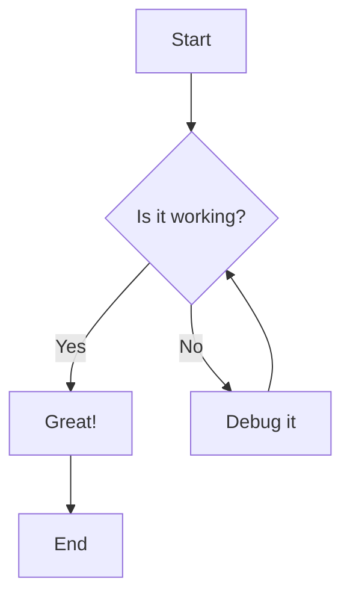
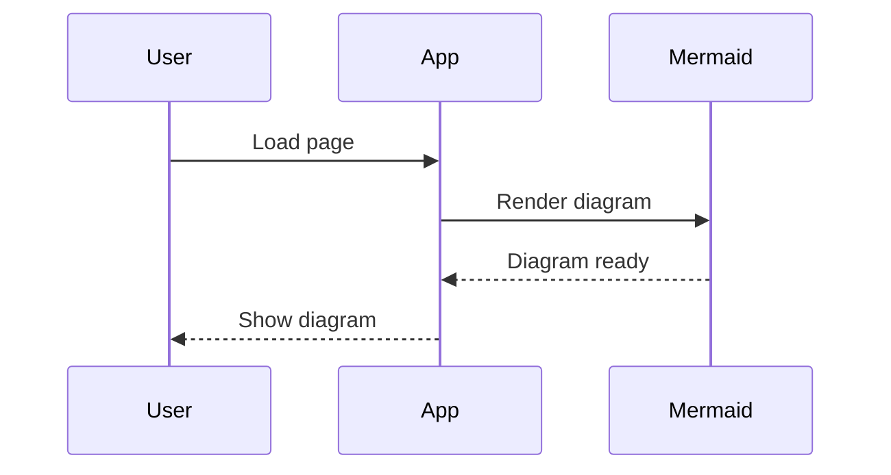
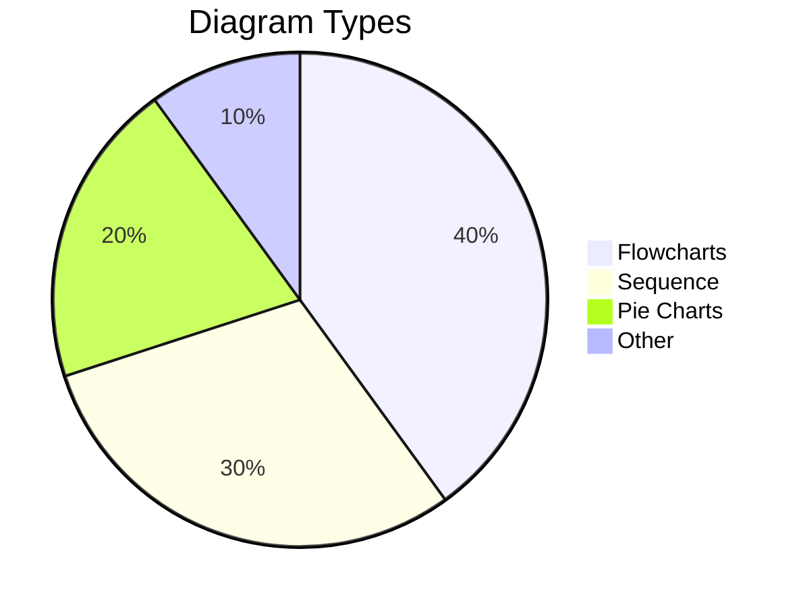

This file tests that Mermaid diagrams work correctly in regular Markdown files.

## Simple Flowchart

```mermaid
graph TD
    A[Start] --> B{Is it working?}
    B -->|Yes| C[Great!]
    B -->|No| D[Debug it]
    D --> B
    C --> E[End]
```

## Sequence Diagram

```mermaid
sequenceDiagram
    participant User
    participant App
    participant Mermaid
    
    User->>App: Load page
    App->>Mermaid: Render diagram
    Mermaid-->>App: Diagram ready
    App-->>User: Show diagram
```

## Simple Pie Chart

```mermaid
pie title Diagram Types
    "Flowcharts" : 40
    "Sequence" : 30
    "Pie Charts" : 20
    "Other" : 10
```
